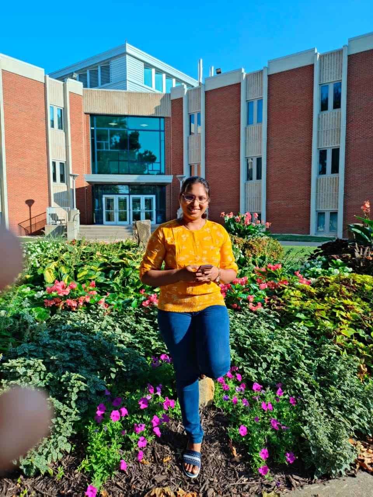

# Vyshnavi Kattamuri

Myself Vyshnavi Kattamuri.I am very much interested in learning new things.I completed my Undergrdauation(CSE) in 2020.Afetr Completing my undergraduation I joined a company named DXC Technology.There I have been worked as Frontend Developer for 1 year.And then moved to an MNC Accenture Solutions Pt Lmtd.There I had worked for 1 year.In this one year I have worked as a PeopleSoft Developer for 4 months using Oracle Peoplesoft Tool and then moved to a Developing project which is using React Js.In this project I understood that i am lacking in some parts of coding languages so i joined masters program in Northwest Missouri State University.

